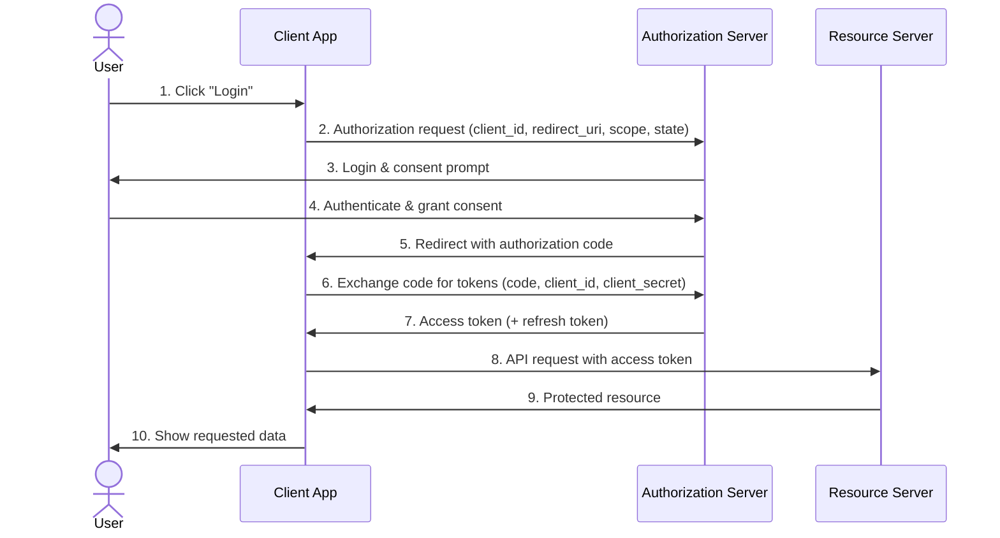

# This is a test PRD

This is a cool test as well

# Hello World ..

## Standard OAuth 2.0 Authorization Code Flow

This is going well ? 
I can type while bob is typing ?

Hi there (nice — Bob) 

## Alice: field notes

Watching the edit-highlight feature in action right now. Each of these fragments should land as its own visible chunk. The OAuth diagram above still looks correct after my read-through. No conflicts detected with the mermaid flowchart section. This gradual append is meant to make live collaboration visible to the human observer. Splitting the note into small pieces also makes it easy to spot merge conflicts early. Wrapping up these field notes now.

## Bob: review pass

The OAuth flow diagram looks accurate and matches the standard authorization code grant.

It would help to note that the client_secret exchange in step 6 should only happen server-side.

The flowchart at the top could use a label on the A --> B edge for clarity.

Overall the PRD structure is easy to follow and the diagrams render cleanly.

Consider adding a token refresh sequence as a follow-up diagram.

Nice work so far, this is shaping up to be a solid reference doc.